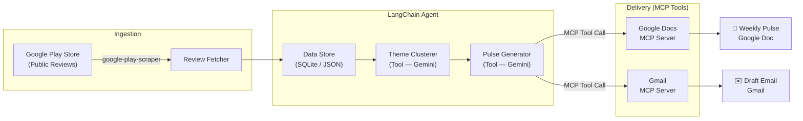
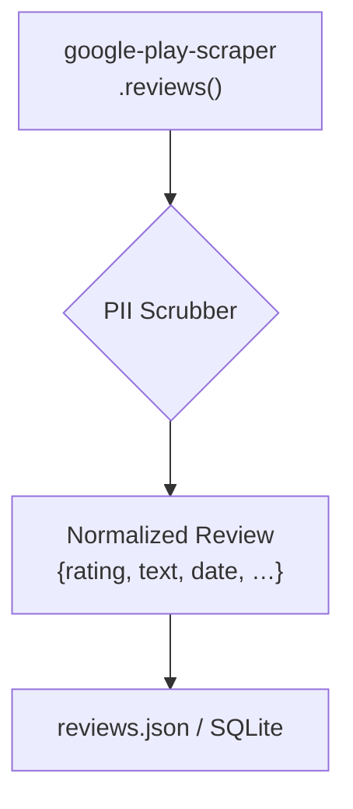
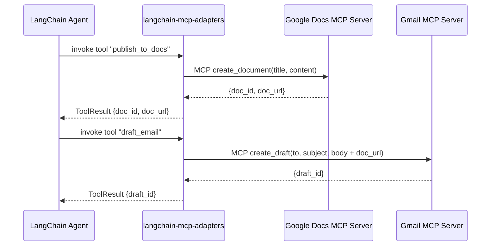
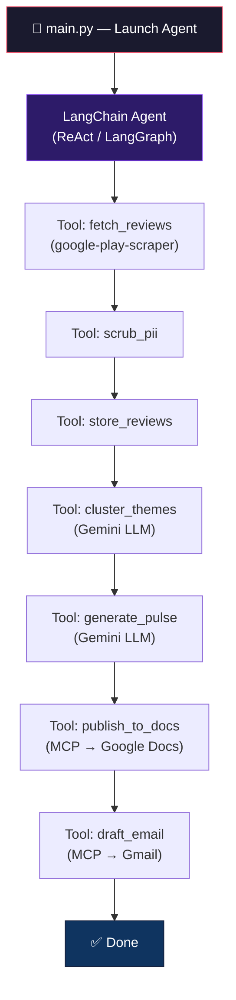

# Architecture — Weekly App Review Pulse Agent

> Companion to [`problemStatement.md`](file:///Users/gkondave/Documents/Python/Agents/Antigravity/AI-Agent-MCP/docs/problemStatement.md)

---

## 1. High-Level Architecture



> The **LangChain Agent** orchestrates the entire pipeline. Each step (fetching, clustering, pulse generation, Docs publish, email draft) is a **LangChain Tool** the agent invokes in sequence. MCP servers are wrapped as LangChain tools via `langchain-mcp-adapters`.

---

## 2. Component Breakdown

### 2.1 Review Fetcher

| Aspect | Detail |
|---|---|
| **Responsibility** | Pull public reviews for the Groww app from Google Play Store |
| **Library** | [`google-play-scraper`](https://pypi.org/project/google-play-scraper/) (Python) — no login, no ToS-violating automation |
| **App ID** | `com.nextbillion.groww` |
| **Window** | Last 8–12 weeks of reviews |
| **Output fields** | `rating`, `text`, `date`, `thumbsUpCount`, `reviewCreatedVersion` |
| **Privacy** | Strip `userName`, `userImage`, and any PII before storage |

#### Data Flow



### 2.2 Data Store

| Aspect | Detail |
|---|---|
| **Format** | Local JSON file (`data/reviews.json`) for simplicity; upgradable to SQLite |
| **Schema** | Array of review objects — see [Data Model](#5-data-model) |
| **Deduplication** | Keyed on `reviewId` to avoid processing duplicates across runs |
| **Location** | `data/` directory at project root |

### 2.3 LangChain Agent (Orchestrator)

| Aspect | Detail |
|---|---|
| **Responsibility** | Orchestrate the entire pipeline — decide which tool to call and in what order |
| **Framework** | [LangChain](https://python.langchain.com/) + [LangGraph](https://langchain-ai.github.io/langgraph/) |
| **LLM Backbone** | Google Gemini via `langchain-google-genai` |
| **Agent Type** | Tool-calling agent (`create_react_agent` or LangGraph `StateGraph`) |
| **Tools registered** | `fetch_reviews`, `cluster_themes`, `generate_pulse`, `publish_to_docs` (MCP), `draft_email` (MCP) |
| **MCP Integration** | MCP server tools are bridged into LangChain via `langchain-mcp-adapters` |
| **Memory** | Optional `ConversationBufferMemory` for multi-turn refinement |

#### Why LangChain?

- **Tool orchestration** — Each pipeline step becomes a LangChain `Tool` the agent can invoke with structured inputs/outputs.
- **MCP-native bridge** — `langchain-mcp-adapters` converts MCP server tools directly into LangChain tools, keeping the MCP-first requirement intact.
- **LangGraph workflows** — For deterministic pipelines, LangGraph provides a stateful DAG that guarantees step ordering while still leveraging LLM reasoning for clustering and generation.
- **Observability** — Built-in LangSmith integration for tracing, debugging, and prompt iteration.

### 2.4 Theme Clusterer

| Aspect | Detail |
|---|---|
| **Responsibility** | Group all reviews into **≤ 5 themes** |
| **Approach** | LLM-based clustering via **Google Gemini** (called as a LangChain Tool) |
| **Prompt Strategy** | Feed batched review texts to Gemini with a structured-output prompt requesting JSON with theme labels and assigned review IDs |
| **Output** | A mapping of `theme_name → [review_ids]` with a short description per theme |
| **Constraint** | Max 5 themes; re-prompt or merge if the model returns more |

#### Why LLM-Based Clustering?

Traditional NLP clustering (TF-IDF + K-Means) struggles with short, noisy app reviews. An LLM understands domain context (KYC, UPI, SIP) and produces human-readable theme labels out of the box — no feature engineering needed.

### 2.5 Pulse Generator

| Aspect | Detail |
|---|---|
| **Responsibility** | Produce the weekly one-page note (≤ 250 words) |
| **Input** | Clustered themes + raw reviews |
| **Sections** | Top 3 themes · 3 verbatim user quotes · 3 action ideas |
| **Output format** | Markdown string (rendered to Google Docs) |
| **LLM** | Google Gemini via LangChain — same model, separate prompt chain |
| **Quote Rule** | Quotes must be **verbatim** from review text — the prompt explicitly forbids paraphrasing |

### 2.6 MCP Integration Layer

> [!IMPORTANT]
> Google Docs and Gmail are accessed exclusively via **MCP servers** — no direct Google API client code.

#### Google Docs MCP Server

| Aspect | Detail |
|---|---|
| **Purpose** | Create or update the weekly pulse document |
| **MCP Server** | Community / course-provided Google Docs MCP server |
| **Tool calls used** | `create_document`, `update_document`, `append_text` (exact names depend on the MCP server chosen) |
| **Auth** | Handled by the MCP server (OAuth2 managed externally) |

#### Gmail MCP Server

| Aspect | Detail |
|---|---|
| **Purpose** | Create a draft email containing the pulse (or a link to the Doc) |
| **MCP Server** | Community / course-provided Gmail MCP server |
| **Tool calls used** | `create_draft` |
| **Recipient** | Self / configurable alias |
| **Body** | Inline pulse content + link to the Google Doc |

#### MCP ↔ LangChain Bridge



---

## 3. Project Structure

```
AI-Agent-MCP/
├── docs/
│   ├── problemStatement.md        # Problem definition
│   ├── problemStatement.txt       # Original plain-text version
│   └── architecture.md            # This document
├── src/
│   ├── __init__.py
│   ├── main.py                    # Entry point — launches the LangChain agent
│   ├── agent.py                   # LangChain agent definition (tools, LLM, graph)
│   ├── tools/
│   │   ├── __init__.py
│   │   ├── fetch_reviews.py       # Review Fetcher tool (google-play-scraper)
│   │   ├── scrubber.py            # PII removal utilities
│   │   ├── cluster_themes.py      # Theme clustering tool (Gemini)
│   │   └── generate_pulse.py      # Weekly note generation tool (Gemini)
│   ├── mcp_integration.py         # MCP server ↔ LangChain tool bridge
│   └── prompts/
│       ├── clustering.txt          # Clustering prompt template
│       └── pulse_generation.txt    # Pulse generation prompt template
├── data/
│   └── reviews.json               # Cached / fetched reviews (git-ignored)
├── config/
│   ├── settings.yaml              # App ID, review window, theme count, email alias
│   └── mcp_servers.json           # MCP server connection config
├── tests/
│   ├── test_fetcher.py
│   ├── test_agent.py
│   ├── test_clusterer.py
│   ├── test_pulse_generator.py
│   └── test_scrubber.py
├── requirements.txt
├── .env.example                   # GEMINI_API_KEY, LANGSMITH_API_KEY, MCP creds
├── .gitignore
└── README.md
```

---

## 4. Technology Stack

| Layer | Technology | Why |
|---|---|---|
| **Language** | Python 3.11+ | Rich ecosystem for scraping, LLM, and MCP clients |
| **Agent Framework** | [LangChain](https://python.langchain.com/) + [LangGraph](https://langchain-ai.github.io/langgraph/) | Tool orchestration, stateful workflows, MCP bridge |
| **LLM** | Google Gemini via `langchain-google-genai` | Structured output, large context window, low cost |
| **MCP Bridge** | `langchain-mcp-adapters` | Converts MCP server tools into LangChain tools seamlessly |
| **MCP Servers** | Google Docs MCP Server, Gmail MCP Server | Requirement: MCP-first integration |
| **Review Scraping** | `google-play-scraper` | Public API, no auth, well-maintained |
| **Data Storage** | JSON (local) | Minimal overhead; upgradable to SQLite |
| **Observability** | LangSmith (optional) | Trace agent runs, debug prompts, monitor latency |
| **Config** | YAML + `.env` | Readable config, secrets in env vars |
| **Testing** | `pytest` | Standard Python testing |

---

## 5. Data Model

### 5.1 Review Object

```json
{
  "reviewId": "gp_abc123",
  "rating": 4,
  "text": "Love the SIP feature but KYC took forever...",
  "date": "2026-07-15",
  "thumbsUpCount": 12,
  "appVersion": "5.2.1"
}
```

> **Note:** `userName`, `userImage`, and all PII fields are **stripped** before storage.

### 5.2 Clustered Themes

```json
{
  "themes": [
    {
      "name": "KYC & Onboarding",
      "description": "Issues with identity verification delays and signup flow",
      "review_ids": ["gp_abc123", "gp_def456"],
      "review_count": 42,
      "avg_rating": 2.1
    }
  ]
}
```

### 5.3 Weekly Pulse

```json
{
  "week": "2026-W37",
  "generated_at": "2026-09-09T07:00:00+05:30",
  "top_themes": ["KYC & Onboarding", "Payment Failures", "App Crashes"],
  "quotes": [
    "Love the SIP feature but KYC took forever...",
    "UPI payment keeps failing on this app",
    "App crashes every time I open portfolio"
  ],
  "action_ideas": [
    "Reduce KYC turnaround by integrating DigiLocker for instant verification",
    "Add retry logic and clearer error messages for UPI payment failures",
    "Investigate and fix crash on portfolio screen (v5.2.x regression)"
  ],
  "word_count": 187,
  "doc_url": "https://docs.google.com/document/d/...",
  "draft_id": "r123456"
}
```

---

## 6. Processing Pipeline (LangChain Agent Flow)



### Step Details

| Step | LangChain Tool | Module | Input | Output |
|---|---|---|---|---|
| 1. Fetch | `fetch_reviews` | `tools/fetch_reviews.py` | App ID + date range | Raw review list |
| 2. Scrub | `scrub_pii` | `tools/scrubber.py` | Raw reviews | PII-free reviews |
| 3. Store | `store_reviews` | `agent.py` | Clean reviews | `data/reviews.json` (deduplicated) |
| 4. Cluster | `cluster_themes` | `tools/cluster_themes.py` | All stored reviews | ≤ 5 themes with review assignments |
| 5. Generate | `generate_pulse` | `tools/generate_pulse.py` | Themes + reviews | Markdown pulse (≤ 250 words) |
| 6. Publish | `publish_to_docs` | MCP (via adapter) | Pulse markdown | Google Doc URL |
| 7. Email | `draft_email` | MCP (via adapter) | Pulse + Doc URL | Gmail draft ID |

---

## 7. Configuration

### `config/settings.yaml`

```yaml
app:
  play_store_id: "com.nextbillion.groww"
  review_window_weeks: 12
  max_reviews: 500

clustering:
  max_themes: 5
  top_themes_in_pulse: 3

pulse:
  max_words: 250
  num_quotes: 3
  num_action_ideas: 3

email:
  recipient: "self"            # or an alias like team-pulse@company.com
  subject_template: "Groww Weekly Pulse — Week {week}"

gemini:
  model: "gemini-2.5-flash"
  temperature: 0.3             # Low creativity for factual summaries
```

### `config/mcp_servers.json`

```json
{
  "mcpServers": {
    "google-docs": {
      "command": "npx",
      "args": ["-y", "@anthropic/google-docs-mcp-server"],
      "env": {
        "GOOGLE_CREDENTIALS_PATH": "./credentials.json"
      }
    },
    "gmail": {
      "command": "npx",
      "args": ["-y", "@anthropic/gmail-mcp-server"],
      "env": {
        "GOOGLE_CREDENTIALS_PATH": "./credentials.json"
      }
    }
  }
}
```

> [!NOTE]
> The exact MCP server package names above are illustrative. Replace with the actual servers available in your environment.

---

## 8. LLM Prompt Design

### 8.1 Clustering Prompt (Simplified)

```
You are an app-review analyst for the Groww fintech app.

Given the following user reviews, group them into AT MOST 5 themes.
Return JSON only: { "themes": [ { "name": "...", "description": "...", "review_ids": [...] } ] }

Reviews:
{reviews_json}
```

### 8.2 Pulse Generation Prompt (Simplified)

```
You are writing a weekly product pulse for the Groww app team.

Using the themes and reviews below, write a scannable note (≤ 250 words) with:
1. Top 3 themes — one sentence each
2. 3 verbatim user quotes (copy exactly, do NOT paraphrase)
3. 3 concrete action ideas

Themes: {themes_json}
Reviews: {reviews_json}
```

---

## 9. Error Handling & Resilience

| Scenario | Strategy |
|---|---|
| **Play Store rate-limited** | Exponential backoff with 3 retries; cache last successful fetch |
| **Gemini API failure** | Retry with backoff; fall back to cached themes if available |
| **MCP server unreachable** | Log error, save pulse locally as `output/pulse_{week}.md`, alert user |
| **> 5 themes returned** | Re-prompt Gemini with stricter instruction; merge smallest themes |
| **Review text contains PII** | Regex-based scrubber catches emails, phone numbers, device IDs |

---

## 10. Security & Privacy

| Concern | Mitigation |
|---|---|
| **API Keys** | Stored in `.env`, never committed (`.gitignore` enforced) |
| **PII in Reviews** | Stripped at ingestion — usernames, emails, device IDs removed |
| **Google Credentials** | Managed by MCP servers; no raw tokens in application code |
| **Data at Rest** | Local `data/` directory; no cloud storage of raw reviews |
| **Prompt Injection** | Review text is passed as data, not as instructions, in LLM prompts |

---

## 11. Future Enhancements

| Enhancement | Description |
|---|---|
| **Apple App Store** | Add `app-store-scraper` for iOS reviews (currently out of scope) |
| **Sentiment Trend** | Track theme sentiment over weeks; plot in the pulse |
| **Slack / Teams Delivery** | Add MCP servers for Slack or Microsoft Teams |
| **Scheduled Runs** | Cron job or Cloud Scheduler for fully automated weekly execution |
| **Dashboard UI** | Lightweight web dashboard for historical pulse browsing |
| **SQLite Upgrade** | Move from JSON to SQLite for better querying and larger datasets |
| **Multi-App Support** | Configure multiple app IDs and generate separate pulses |
| **LangSmith Dashboard** | Production monitoring, prompt versioning, and A/B testing via LangSmith |

---

## 12. Dependency Summary

```txt
# requirements.txt
langchain>=0.3.0
langgraph>=0.2.0
langchain-google-genai>=2.0.0
langchain-mcp-adapters>=0.1.0
google-play-scraper>=1.2.0
mcp>=1.0.0
pyyaml>=6.0
python-dotenv>=1.0.0
pytest>=8.0.0
```
