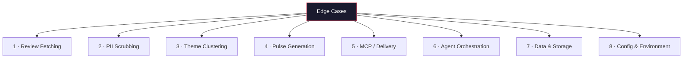

# Edge Cases & Corner Scenarios

> Derived from [`architecture.md`](file:///Users/gkondave/Documents/Python/Agents/Antigravity/AI-Agent-MCP/docs/architecture.md) and [`implementation-plan.md`](file:///Users/gkondave/Documents/Python/Agents/Antigravity/AI-Agent-MCP/docs/implementation-plan.md)

---

## Edge Case Map



---

## 1. Review Fetching

### EC-1.1 — Zero Reviews Returned

| Attribute | Detail |
|---|---|
| **Scenario** | The `google-play-scraper` returns an empty list — new app, date window too narrow, or API glitch |
| **Impact** | Pipeline has nothing to cluster or summarize |
| **Handling** | Log warning `"No reviews found for the given date range"`. Skip clustering/generation. Exit gracefully with a message: _"No new reviews to process this week."_ Do **not** create a Doc or draft |
| **Test** | Mock `reviews()` → `[]`. Assert agent exits without errors and no MCP calls are made |

### EC-1.2 — Very Few Reviews (< 10)

| Attribute | Detail |
|---|---|
| **Scenario** | Only 3–9 reviews in the date window |
| **Impact** | Clustering into 5 themes is meaningless with so few data points |
| **Handling** | Reduce `max_themes` dynamically: `min(config.max_themes, len(reviews) // 3)` with a floor of 1. Adjust the prompt to say "group into AT MOST {n} themes" |
| **Test** | Feed 5 reviews. Assert ≤ 2 themes returned |

### EC-1.3 — Extremely Large Volume (10,000+ Reviews)

| Attribute | Detail |
|---|---|
| **Scenario** | Viral event causes a surge — scraper returns thousands of reviews |
| **Impact** | Exceeds LLM context window; slow processing; high API cost |
| **Handling** | Cap at `config.max_reviews` (default 500). Sample reviews: prioritize recent + high-`thumbsUpCount`. Batch into chunks if needed for LLM processing |
| **Test** | Feed 10,000 synthetic reviews. Assert only 500 are processed and LLM receives batched input |

### EC-1.4 — Play Store Rate Limiting / HTTP Errors

| Attribute | Detail |
|---|---|
| **Scenario** | `google-play-scraper` raises `HTTPError`, timeout, or rate-limit response |
| **Impact** | No fresh reviews fetched |
| **Handling** | Exponential backoff with 3 retries (1s → 2s → 4s). On final failure, fall back to `data/reviews.json` cache. Log error with timestamp. If cache is also empty → EC-1.1 flow |
| **Test** | Mock HTTP 429 for first 2 calls, success on 3rd. Assert retry logic works |

### EC-1.5 — Play Store API Structure Changes

| Attribute | Detail |
|---|---|
| **Scenario** | `google-play-scraper` library update or Play Store API change alters response field names |
| **Impact** | Key extraction fails — `KeyError` on `text`, `rating`, etc. |
| **Handling** | Wrap field access in safe getter with defaults: `review.get('text', '')`. Log warning for missing fields. Skip reviews where `text` is empty |
| **Test** | Feed reviews with missing `text` field. Assert they are filtered out without crash |

### EC-1.6 — All Reviews are Same Rating

| Attribute | Detail |
|---|---|
| **Scenario** | Every review is 1-star (or 5-star) — no rating variance |
| **Impact** | `avg_rating` per theme is identical; no differentiation |
| **Handling** | Not a failure — proceed normally. Clustering still works on text content. The pulse generator should note the uniform sentiment if applicable |
| **Test** | Feed 50 reviews all rated 1-star. Assert themes still generated based on text, not rating |

### EC-1.7 — Reviews in Multiple Languages

| Attribute | Detail |
|---|---|
| **Scenario** | Reviews in Hindi, Telugu, Marathi, Tamil mixed with English |
| **Impact** | LLM clustering may misgroup or fail to understand non-English text |
| **Handling** | Pass all reviews to Gemini regardless — it supports multilingual input. Add prompt instruction: _"Reviews may be in multiple languages. Cluster by topic, not language."_ Quotes in the pulse should be in their original language |
| **Test** | Feed mixed English + Hindi reviews. Assert themes are topic-based, not language-based |

### EC-1.8 — Duplicate Reviews from Same User

| Attribute | Detail |
|---|---|
| **Scenario** | User posts identical review text multiple times (different `reviewId`) |
| **Impact** | Inflates theme counts; same quote may appear multiple times |
| **Handling** | Dedup on `reviewId` (already in place). Additionally, detect near-duplicate `text` (exact match after lowercasing + whitespace normalization) and keep only the most recent |
| **Test** | Feed 3 reviews with identical text but different IDs. Assert only 1 is stored |

---

## 2. PII Scrubbing

### EC-2.1 — PII Embedded in Review Text

| Attribute | Detail |
|---|---|
| **Scenario** | User writes: _"Contact me at john@gmail.com or 9876543210 for help"_ |
| **Impact** | PII leaks into themes, quotes, and the published Google Doc |
| **Handling** | Regex scrubber replaces: emails → `[EMAIL]`, phone numbers → `[PHONE]`, 15-digit IMEI → `[DEVICE_ID]`. Run **before** any LLM processing |
| **Test** | Feed review with email + phone. Assert both are replaced in output |

### EC-2.2 — PII in Non-Standard Formats

| Attribute | Detail |
|---|---|
| **Scenario** | User writes: _"my number is nine eight seven six five four three two one zero"_ or _"j o h n at gmail dot com"_ |
| **Impact** | Regex won't catch spelled-out PII |
| **Handling** | Accept this as a limitation of regex-based scrubbing. Document in README. For v2, consider LLM-based PII detection |
| **Test** | Feed spelled-out PII. Assert it passes through (known limitation). Log warning if detected heuristically |

### EC-2.3 — Review Text is Empty or Null

| Attribute | Detail |
|---|---|
| **Scenario** | Rating-only review with `text: ""` or `text: null` |
| **Impact** | Scrubber may crash on `None`; LLM gets empty strings |
| **Handling** | Filter out reviews where `text` is empty, `None`, or whitespace-only **after** scrubbing. These reviews contribute to `avg_rating` but not to clustering |
| **Test** | Feed mix of reviews: some with text, some with `null`. Assert only reviews with text are passed to clusterer |

### EC-2.4 — Review Contains Only PII

| Attribute | Detail |
|---|---|
| **Scenario** | User writes: _"9876543210"_ — after scrubbing, text becomes _"[PHONE]"_ |
| **Impact** | Review has no usable content for clustering |
| **Handling** | After scrubbing, if remaining text (excluding PII markers) is < 5 characters, discard the review |
| **Test** | Feed review with only a phone number. Assert it is discarded post-scrub |

### EC-2.5 — Aadhar / PAN Numbers in Text

| Attribute | Detail |
|---|---|
| **Scenario** | Indian users sharing Aadhar (12-digit) or PAN (ABCDE1234F) numbers in reviews |
| **Impact** | Sensitive government ID leakage |
| **Handling** | Add India-specific regex patterns: Aadhar (`\d{4}\s?\d{4}\s?\d{4}`) → `[AADHAR]`, PAN (`[A-Z]{5}\d{4}[A-Z]`) → `[PAN]` |
| **Test** | Feed review with Aadhar and PAN numbers. Assert both are redacted |

---

## 3. Theme Clustering

### EC-3.1 — LLM Returns > 5 Themes

| Attribute | Detail |
|---|---|
| **Scenario** | Despite the prompt saying "AT MOST 5", Gemini returns 7 themes |
| **Impact** | Violates constraint |
| **Handling** | **Strategy 1:** Re-prompt with stricter instruction: _"You returned {n} themes. Merge the smallest themes to bring the total to 5 or fewer."_ **Strategy 2:** Programmatically merge the two smallest themes (by review count) and relabel. Max 2 retries before using Strategy 2 |
| **Test** | Mock LLM returning 7 themes. Assert final output has ≤ 5 |

### EC-3.2 — LLM Returns Invalid JSON

| Attribute | Detail |
|---|---|
| **Scenario** | Gemini returns markdown-wrapped JSON, truncated JSON, or natural language instead of JSON |
| **Impact** | `json.loads()` fails; pipeline stops |
| **Handling** | Strip markdown code fences (```` ```json ... ``` ````). Try `json.loads()`. If still fails, re-prompt once: _"Your response was not valid JSON. Return ONLY the JSON object."_ If still fails, raise `ClusteringError` with the raw response for debugging |
| **Test** | Mock response with markdown fences. Assert JSON is still parsed correctly |

### EC-3.3 — LLM Returns Empty Themes

| Attribute | Detail |
|---|---|
| **Scenario** | `{"themes": []}` — no themes generated |
| **Impact** | No pulse can be generated |
| **Handling** | Re-prompt once with: _"You returned no themes. Every review should belong to at least one theme."_ If still empty, create a single catch-all theme: `"General Feedback"` containing all review IDs |
| **Test** | Mock empty themes response. Assert fallback theme is created |

### EC-3.4 — Reviews Assigned to Multiple Themes

| Attribute | Detail |
|---|---|
| **Scenario** | Same `reviewId` appears in two different themes |
| **Impact** | `review_count` and `avg_rating` are inflated; quotes may repeat |
| **Handling** | Accept multi-assignment (a review can belong to multiple themes — this is semantically valid). But for `review_count`, count unique IDs only. For quote selection, deduplicate |
| **Test** | Mock response with overlapping review IDs. Assert `review_count` uses unique counts |

### EC-3.5 — Some Reviews Not Assigned to Any Theme

| Attribute | Detail |
|---|---|
| **Scenario** | LLM "forgets" to assign 20% of reviews to themes |
| **Impact** | Those reviews are invisible in the pulse |
| **Handling** | After clustering, find orphan review IDs. If > 10% are orphaned, re-prompt: _"The following reviews were not assigned to any theme: {ids}. Please assign them."_ If ≤ 10%, assign to an "Other" theme |
| **Test** | Mock response missing 15% of review IDs. Assert re-prompt is triggered |

### EC-3.6 — All Reviews in a Single Theme

| Attribute | Detail |
|---|---|
| **Scenario** | LLM groups everything into one theme: _"App Feedback"_ |
| **Impact** | No differentiation; pulse has only 1 theme instead of top 3 |
| **Handling** | If only 1 theme and > 20 reviews, re-prompt: _"You created only 1 theme. Try to identify sub-topics within these reviews."_ If still 1 theme, proceed — the pulse will have 1 theme instead of 3 |
| **Test** | Mock single-theme response with 50 reviews. Assert re-prompt is attempted |

### EC-3.7 — Theme Names are Too Generic or Too Long

| Attribute | Detail |
|---|---|
| **Scenario** | Theme names like _"Issues"_, _"Problems"_, or 50+ character names |
| **Impact** | Pulse is unreadable or unhelpful |
| **Handling** | Validate: theme name must be 3–40 characters. If too short/long, re-prompt asking for _"descriptive but concise theme names (3–40 characters)"_ |
| **Test** | Mock theme named "X". Assert re-prompt for better name |

---

## 4. Pulse Generation

### EC-4.1 — Pulse Exceeds 250 Words

| Attribute | Detail |
|---|---|
| **Scenario** | Generated pulse is 380 words |
| **Impact** | Violates length constraint; not scannable |
| **Handling** | Post-check: count words. If > 250, re-prompt: _"Your note was {n} words. Please condense to ≤ 250 words while keeping all required sections."_ Max 2 retries. If still over, truncate to 250 words and append _"[truncated]"_ |
| **Test** | Mock 400-word pulse. Assert re-prompt reduces it |

### EC-4.2 — LLM Paraphrases Quotes Instead of Copying Verbatim

| Attribute | Detail |
|---|---|
| **Scenario** | Prompt says "copy exactly" but Gemini subtly rephrases: _"KYC took a long time"_ instead of _"KYC took forever"_ |
| **Impact** | Violates "verbatim quotes" requirement; misleading |
| **Handling** | Post-validation: for each quote in the pulse, check if it exists as a substring in any source review text (case-insensitive, whitespace-normalized). If not found, flag and replace with the closest matching review text (fuzzy match with threshold > 0.85). Log the substitution |
| **Test** | Mock pulse with paraphrased quote. Assert validation catches it and substitutes the real quote |

### EC-4.3 — Fewer Than 3 Themes Available

| Attribute | Detail |
|---|---|
| **Scenario** | Only 1–2 themes were clustered (EC-3.6 or very few reviews) |
| **Impact** | Pulse template expects "Top 3 themes" but only 1–2 exist |
| **Handling** | Dynamically adjust: _"Top {n} themes"_ where `n = min(3, len(themes))`. Update prompt to match. The pulse is still valid with fewer themes |
| **Test** | Feed 2 themes. Assert pulse has 2 themes, not 3 |

### EC-4.4 — Fewer Than 3 Usable Quotes

| Attribute | Detail |
|---|---|
| **Scenario** | After PII scrubbing, only 2 reviews have meaningful text |
| **Impact** | Can't produce 3 quotes |
| **Handling** | Use as many as available: `num_quotes = min(3, len(usable_reviews))`. Update prompt accordingly |
| **Test** | Feed 2 usable reviews. Assert pulse has 2 quotes |

### EC-4.5 — Generated Pulse Contains PII

| Attribute | Detail |
|---|---|
| **Scenario** | Despite scrubbed input, the LLM hallucinates or reconstructs PII |
| **Impact** | Privacy violation in published Doc |
| **Handling** | Run the PII scrubber on the **generated pulse text** as a final check before publishing |
| **Test** | Mock pulse output containing an email address. Assert scrubber catches it |

### EC-4.6 — Pulse is Empty or Malformed

| Attribute | Detail |
|---|---|
| **Scenario** | LLM returns empty string, or output is not valid Markdown |
| **Impact** | Google Doc would be empty |
| **Handling** | Validate pulse is non-empty and contains expected sections (themes, quotes, actions). If malformed, re-prompt once. If still empty, log error and save raw themes + reviews locally as fallback |
| **Test** | Mock empty LLM response. Assert re-prompt is triggered |

### EC-4.7 — Action Ideas are Generic / Not Grounded in Themes

| Attribute | Detail |
|---|---|
| **Scenario** | LLM generates: _"Improve the app"_, _"Fix bugs"_, _"Listen to users"_ |
| **Impact** | Useless action items that don't help the product team |
| **Handling** | Prompt engineering: _"Each action idea MUST reference a specific theme and include a concrete step."_ Post-check: verify each action contains at least one keyword from the corresponding theme |
| **Test** | Mock generic actions. Assert validation flags them |

---

## 5. MCP / Delivery

### EC-5.1 — MCP Server Fails to Start

| Attribute | Detail |
|---|---|
| **Scenario** | `npx` command for MCP server fails — missing package, Node.js not installed, etc. |
| **Impact** | Cannot publish to Docs or send email |
| **Handling** | Catch `subprocess` errors. Log the error with full command + stderr. Save pulse to `output/pulse_{week}.md`. Print to console. Alert user: _"MCP servers unavailable — pulse saved locally"_ |
| **Test** | Mock subprocess failure. Assert local fallback is triggered |

### EC-5.2 — Google OAuth Token Expired

| Attribute | Detail |
|---|---|
| **Scenario** | `credentials.json` token has expired; MCP server returns 401 |
| **Impact** | Docs/Gmail calls fail |
| **Handling** | MCP servers should handle token refresh automatically. If they don't, catch 401 error, log _"OAuth token expired — please re-authenticate"_, and fall back to local save |
| **Test** | Mock 401 response from MCP. Assert error message guides user to re-auth |

### EC-5.3 — Google Doc Already Exists (Same Week)

| Attribute | Detail |
|---|---|
| **Scenario** | Agent runs twice in the same week; Doc for Week 37 already exists |
| **Impact** | Duplicate Docs or update conflict |
| **Handling** | Search for existing Doc by title pattern `"Groww Weekly Pulse — Week {n}"`. If found, **update** the existing Doc instead of creating a new one. If MCP server doesn't support search, create a new Doc with suffix: _"Groww Weekly Pulse — Week 37 (v2)"_ |
| **Test** | Mock existing Doc search result. Assert update is called instead of create |

### EC-5.4 — Gmail Draft Creation Fails

| Attribute | Detail |
|---|---|
| **Scenario** | Gmail MCP `create_draft` fails — quota, permission, or network error |
| **Impact** | Email draft not created, but Doc may already be published |
| **Handling** | This is the **last step** — Doc is already published. Log error. Print the Doc URL to console so user can manually share it. Don't roll back the Doc |
| **Test** | Mock draft creation failure. Assert Doc URL is still printed |

### EC-5.5 — MCP Tool Returns Unexpected Schema

| Attribute | Detail |
|---|---|
| **Scenario** | MCP server returns `{id: "..."}` instead of expected `{doc_id: "...", doc_url: "..."}` |
| **Impact** | `KeyError` when extracting `doc_url` |
| **Handling** | Access fields safely with `.get()`. If `doc_url` is missing, try constructing it from `doc_id`: `https://docs.google.com/document/d/{doc_id}`. Log warning about unexpected schema |
| **Test** | Mock response missing `doc_url`. Assert URL is constructed from `doc_id` |

### EC-5.6 — Google Doc Content Formatting Lost

| Attribute | Detail |
|---|---|
| **Scenario** | Markdown formatting (headers, bold, quotes) doesn't render properly in Google Docs |
| **Impact** | Doc appears as raw markdown text — ugly and hard to read |
| **Handling** | If MCP server supports HTML input, convert Markdown → HTML before publishing. If only plain text, strip markdown syntax and use simple formatting. Test the actual rendering during Phase 5 |
| **Test** | Publish sample Markdown to Docs. Verify visual formatting matches expectations |

### EC-5.7 — Email Body Too Long for Gmail

| Attribute | Detail |
|---|---|
| **Scenario** | Full pulse + Doc link exceeds Gmail's draft body limits |
| **Impact** | Draft truncated or creation fails |
| **Handling** | Keep email body concise: include a 2-sentence summary + Doc link. Full pulse stays in the Doc. This aligns with the requirement: _"contains or links to that pulse"_ |
| **Test** | Assert email body is < 5000 characters |

---

## 6. Agent Orchestration

### EC-6.1 — LangChain Agent Calls Tools Out of Order

| Attribute | Detail |
|---|---|
| **Scenario** | ReAct agent decides to generate pulse before clustering, or skips scrubbing |
| **Impact** | Pipeline produces incorrect or PII-contaminated output |
| **Handling** | **Prefer LangGraph `StateGraph`** (deterministic edges) over ReAct for the primary pipeline. If using ReAct, add guardrails: each tool validates its input and raises if preconditions aren't met (e.g., `generate_pulse` raises if `themes` is empty) |
| **Test** | Call `generate_pulse` without prior clustering. Assert it raises `PreconditionError` |

### EC-6.2 — Agent Enters Infinite Loop

| Attribute | Detail |
|---|---|
| **Scenario** | LLM keeps re-calling clustering after validation failure — infinite retry loop |
| **Impact** | Hangs forever; burns API quota |
| **Handling** | Set `max_iterations` on the agent (default: 15). Set per-tool retry limit: max 2 retries. After exhausting retries, proceed with best available output or exit with error |
| **Test** | Mock clustering that always returns invalid output. Assert agent stops after max retries |

### EC-6.3 — Partial Pipeline Failure (Mid-Execution)

| Attribute | Detail |
|---|---|
| **Scenario** | Reviews fetched + clustered successfully, but pulse generation fails |
| **Impact** | Wasted compute; user gets nothing |
| **Handling** | Save intermediate state to `data/pipeline_state.json` after each step. On re-run, detect previous state and resume from last successful step. Log which step failed |
| **Test** | Mock failure at step 5. Re-run. Assert pipeline resumes from step 5, not step 1 |

### EC-6.4 — Agent LLM (Orchestrator) Has Different Opinions Than Tool LLMs

| Attribute | Detail |
|---|---|
| **Scenario** | The orchestrator LLM tries to "improve" tool outputs — re-clustering or editing the pulse |
| **Impact** | Agent second-guesses validated tool results |
| **Handling** | System prompt must explicitly state: _"You are an orchestrator. Call tools and pass their outputs forward. Do NOT modify, re-cluster, or rewrite tool outputs."_ Use LangGraph for strict handoff |
| **Test** | Assert agent output matches tool output exactly (no modifications) |

### EC-6.5 — Gemini API Key is Invalid or Missing

| Attribute | Detail |
|---|---|
| **Scenario** | `.env` file is missing `GEMINI_API_KEY` or the key is revoked |
| **Impact** | All LLM calls fail immediately |
| **Handling** | Validate API key at startup in `main.py` before launching the agent. Make a lightweight test call (e.g., `model.generate_content("test")`). If it fails, exit with clear error: _"Invalid or missing GEMINI_API_KEY. Please check your .env file."_ |
| **Test** | Set empty API key. Assert startup validation catches it before any pipeline work |

---

## 7. Data & Storage

### EC-7.1 — `data/reviews.json` is Corrupted

| Attribute | Detail |
|---|---|
| **Scenario** | Previous run crashed mid-write; JSON file is truncated or malformed |
| **Impact** | `json.loads()` fails on cached data |
| **Handling** | Try loading the file. If `JSONDecodeError`, rename corrupted file to `reviews.json.bak`, log warning, and start fresh (re-fetch all reviews) |
| **Test** | Write corrupt JSON to file. Assert recovery works and file is backed up |

### EC-7.2 — `data/reviews.json` Grows Unbounded

| Attribute | Detail |
|---|---|
| **Scenario** | After 6 months of weekly runs, file has 10,000+ reviews and is slow to load |
| **Impact** | Slow pipeline startup; LLM receives too many reviews |
| **Handling** | On each run, prune reviews older than `config.review_window_weeks` from the cache. Only keep reviews within the active window |
| **Test** | Feed file with 1-year-old reviews. Assert only recent reviews survive pruning |

### EC-7.3 — Disk Full — Can't Write Files

| Attribute | Detail |
|---|---|
| **Scenario** | `data/` directory write fails due to full disk |
| **Impact** | Reviews can't be cached; fallback pulse can't be saved |
| **Handling** | Catch `IOError` / `OSError`. Log error. Continue pipeline in-memory without caching. Alert user: _"Disk full — unable to cache reviews"_ |
| **Test** | Mock disk write failure. Assert pipeline continues in-memory |

### EC-7.4 — Concurrent Runs Cause Race Condition

| Attribute | Detail |
|---|---|
| **Scenario** | Two pipeline instances run simultaneously (cron overlap) |
| **Impact** | Both read/write `reviews.json`; data corruption or duplicate Docs |
| **Handling** | Use a file-based lock (`data/.lock`). If lock exists and is < 1 hour old, exit with _"Another pipeline run is in progress"_. Stale locks (> 1 hour) are force-released |
| **Test** | Simulate concurrent access. Assert second instance exits cleanly |

---

## 8. Configuration & Environment

### EC-8.1 — `settings.yaml` is Missing or Malformed

| Attribute | Detail |
|---|---|
| **Scenario** | Config file deleted, empty, or has invalid YAML syntax |
| **Impact** | All config values are `None`; pipeline behaves unpredictably |
| **Handling** | Validate config at startup using a schema (Pydantic model or manual checks). If missing, use hardcoded defaults and log warning. If malformed YAML, exit with clear error pointing to the syntax issue |
| **Test** | Delete `settings.yaml`. Assert defaults are used. Feed invalid YAML. Assert clear error |

### EC-8.2 — Invalid App ID in Config

| Attribute | Detail |
|---|---|
| **Scenario** | `play_store_id` is `"com.nonexistent.app"` |
| **Impact** | `google-play-scraper` returns error or empty results |
| **Handling** | Catch scraper error. Log _"Invalid app ID: {id}. Please check config/settings.yaml"_. Exit |
| **Test** | Set invalid app ID. Assert clear error message |

### EC-8.3 — `mcp_servers.json` Points to Wrong Server

| Attribute | Detail |
|---|---|
| **Scenario** | Server package name is misspelled or version is incompatible |
| **Impact** | MCP connection fails at Phase 5 |
| **Handling** | Validate MCP server connectivity at startup with a health check. If server doesn't respond, warn user and enable local-only mode |
| **Test** | Set non-existent package name. Assert health check fails gracefully |

### EC-8.4 — Python Version Incompatibility

| Attribute | Detail |
|---|---|
| **Scenario** | User runs with Python 3.8 — `langchain` requires 3.11+ |
| **Impact** | Import errors or syntax errors |
| **Handling** | Add version check at top of `main.py`: `assert sys.version_info >= (3, 11)`. Include `python_requires='>=3.11'` in `pyproject.toml` if used |
| **Test** | Assert version check in `main.py` exists |

### EC-8.5 — Node.js Not Installed (Required for MCP Servers)

| Attribute | Detail |
|---|---|
| **Scenario** | MCP servers use `npx` but Node.js isn't installed |
| **Impact** | `FileNotFoundError: npx not found` |
| **Handling** | Check for `npx` at startup: `shutil.which('npx')`. If missing, log _"Node.js is required for MCP servers. Install it from https://nodejs.org"_ and enable local-only mode |
| **Test** | Mock `shutil.which('npx')` → `None`. Assert warning is logged |

---

## Summary Matrix

| Category | Edge Cases | Severity Distribution |
|---|---|---|
| **Review Fetching** | 8 | 🔴 2 High · 🟡 4 Medium · 🟢 2 Low |
| **PII Scrubbing** | 5 | 🔴 2 High · 🟡 2 Medium · 🟢 1 Low |
| **Theme Clustering** | 7 | 🔴 1 High · 🟡 5 Medium · 🟢 1 Low |
| **Pulse Generation** | 7 | 🔴 2 High · 🟡 3 Medium · 🟢 2 Low |
| **MCP / Delivery** | 7 | 🔴 2 High · 🟡 3 Medium · 🟢 2 Low |
| **Agent Orchestration** | 5 | 🔴 2 High · 🟡 2 Medium · 🟢 1 Low |
| **Data & Storage** | 4 | 🔴 1 High · 🟡 2 Medium · 🟢 1 Low |
| **Config & Environment** | 5 | 🔴 1 High · 🟡 3 Medium · 🟢 1 Low |
| **Total** | **48** | 🔴 **13** · 🟡 **24** · 🟢 **11** |

---

## Priority: Must-Handle Before MVP

> [!CAUTION]
> These edge cases **must** be handled before the first live run. Failure to address them risks data corruption, PII leaks, or a pipeline that silently produces wrong results.

| ID | Edge Case | Why Critical |
|---|---|---|
| **EC-1.1** | Zero reviews returned | Pipeline crash on empty input |
| **EC-1.4** | Play Store rate limiting | No data without retry logic |
| **EC-2.1** | PII in review text | Privacy violation in published Doc |
| **EC-2.5** | Aadhar/PAN in text | Sensitive government ID exposure |
| **EC-3.2** | Invalid JSON from LLM | Pipeline crash — most common LLM failure |
| **EC-4.2** | Paraphrased quotes | Violates core "verbatim" requirement |
| **EC-4.5** | PII in generated pulse | Privacy violation in final output |
| **EC-5.1** | MCP server fails to start | No delivery without fallback |
| **EC-6.1** | Tools called out of order | Incorrect or unsafe output |
| **EC-6.5** | Missing API key | Immediate failure with no useful error |
| **EC-7.1** | Corrupted JSON cache | Pipeline crash on cached data |
| **EC-8.1** | Missing config file | Unpredictable behavior |
| **EC-8.5** | Node.js not installed | MCP servers can't start |
