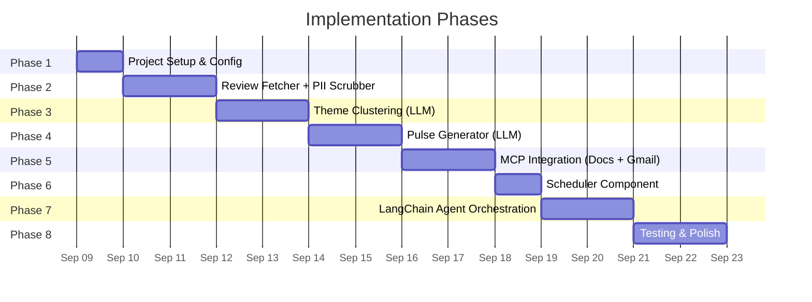
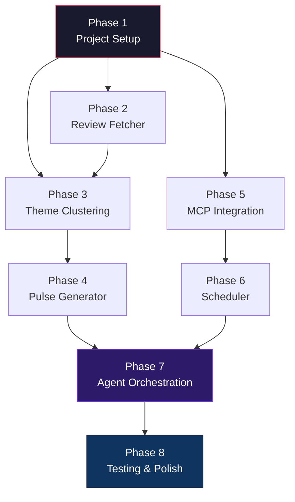

# Implementation Plan — Weekly App Review Pulse Agent

> Derived from [`problemStatement.md`](file:///Users/gkondave/Documents/Python/Agents/Antigravity/AI-Agent-MCP/docs/problemStatement.md) and [`architecture.md`](file:///Users/gkondave/Documents/Python/Agents/Antigravity/AI-Agent-MCP/docs/architecture.md)

---

## Phase Overview



---

## Phase 1: Project Setup & Configuration
**Goal:** Establish the foundation, repository structure, and configuration loader.

- [x] 1.1 Initialize project directory structure (`src/`, `data/`, `config/`, `tests/`)
- [x] 1.2 Create `requirements.txt` with base dependencies
- [x] 1.3 Create Python virtual environment and install dependencies
- [x] 1.4 Create `config/settings.yaml` (app ID, LLM parameters, email config)
- [x] 1.5 Create `.env.example`
- [x] 1.6 Create `.gitignore`
- [x] 1.7 Write a config loader utility (`src/config.py`)
  ```
  AI-Agent-MCP/
  ├── src/
  │   ├── __init__.py
  │   ├── main.py
  │   ├── agent.py
  │   ├── tools/
  │   │   ├── __init__.py
  │   │   ├── fetch_reviews.py
  │   │   ├── scrubber.py
  │   │   ├── cluster_themes.py
  │   │   └── generate_pulse.py
  │   ├── mcp_integration.py
  │   └── prompts/
  │       ├── clustering.txt
  │       └── pulse_generation.txt
  ├── data/
  ├── config/
  ├── tests/
  ```

- [ ] **1.2** Create `requirements.txt` with all dependencies
  ```txt
  langchain>=0.3.0
  langgraph>=0.2.0
  langchain-google-genai>=2.0.0
  langchain-mcp-adapters>=0.1.0
  google-play-scraper>=1.2.0
  mcp>=1.0.0
  pyyaml>=6.0
  python-dotenv>=1.0.0
  pytest>=8.0.0
  ```

- [ ] **1.3** Create Python virtual environment and install dependencies
  ```bash
  python -m venv .venv
  source .venv/bin/activate
  pip install -r requirements.txt
  ```

- [ ] **1.4** Create `config/settings.yaml`
  ```yaml
  app:
    play_store_id: "com.nextbillion.groww"
    review_window_weeks: 12
    max_reviews: 500

  clustering:
    max_themes: 5
    top_themes_in_pulse: 3

  pulse:
    max_words: 250
    num_quotes: 3
    num_action_ideas: 3

  email:
    recipient: "self"
    subject_template: "Groww Weekly Pulse — Week {week}"

  gemini:
    model: "gemini-2.5-flash"
    temperature: 0.3
  ```

- [ ] **1.5** Create `.env.example` with placeholder keys
  ```env
  GEMINI_API_KEY=your-gemini-api-key
  LANGSMITH_API_KEY=your-langsmith-key-optional
  GOOGLE_CREDENTIALS_PATH=./credentials.json
  ```

- [ ] **1.6** Create `.gitignore` (exclude `.env`, `data/`, `.venv/`, `__pycache__/`)

- [ ] **1.7** Write a config loader utility (`src/config.py`) to load `settings.yaml` and `.env`

### Exit Criteria

| Check | Expected Result |
|---|---|
| `pip install -r requirements.txt` | All packages install without errors |
| `python -c "import langchain; import google_play_scraper"` | No import errors |
| Config loader reads `settings.yaml` | Returns dict with `app.play_store_id` |

---

## Phase 2 — Review Fetcher + PII Scrubber

> **Goal:** Fetch reviews from the Google Play Store, strip PII, and store clean reviews locally.

### Tasks

- [x] **2.1** Implement `src/tools/fetch_reviews.py`
  - Use `google-play-scraper` library's `reviews()` function
  - Fetch reviews for `com.nextbillion.groww`
  - Filter to last 8–12 weeks based on `config.review_window_weeks`
  - Paginate up to `config.max_reviews` reviews
  - Return list of raw review dicts

- [x] **2.2** Implement `src/tools/scrubber.py`
  - Remove PII fields: `userName`, `userImage`, `reviewerLanguage`
  - Regex-based scrubbing of review text:
    - Email addresses → `[EMAIL]`
    - Phone numbers → `[PHONE]`
    - Device IDs / IMEI → `[DEVICE_ID]`
  - Return cleaned review objects

- [x] **2.3** Implement data storage logic
  - Save clean reviews to `data/reviews.json`
  - Export reviews to `data/exports/play_store.csv`
  - Deduplication keyed on `reviewId`
  - Merge new reviews with existing cached reviews

- [x] **2.4** Wrap as LangChain Tools
  - `fetch_reviews` tool: takes `app_id` + `weeks` → returns raw reviews
  - `scrub_pii` tool: takes raw reviews → returns clean reviews
  - Use `@tool` decorator with proper descriptions and type hints

- [x] **2.5** Write tests
  - `tests/test_fetcher.py` — mock `google_play_scraper.reviews()`, verify output format
  - `tests/test_scrubber.py` — verify PII removal (emails, phone numbers, usernames)

### Key Files

| File | Purpose |
|---|---|
| [`src/tools/fetch_reviews.py`](file:///Users/gkondave/Documents/Python/Agents/Antigravity/AI-Agent-MCP/src/tools/fetch_reviews.py) | Play Store review fetching |
| [`src/tools/scrubber.py`](file:///Users/gkondave/Documents/Python/Agents/Antigravity/AI-Agent-MCP/src/tools/scrubber.py) | PII removal |
| `data/reviews.json` | Cleaned review storage |

### Exit Criteria

| Check | Expected Result |
|---|---|
| Run fetcher standalone | Returns 100+ reviews from Play Store |
| Scrubber removes PII | No `userName`, emails, or phone numbers in output |
| Reviews saved to JSON | `data/reviews.json` has deduplicated entries |
| Tests pass | `pytest tests/test_fetcher.py tests/test_scrubber.py` — all green |

---

## Phase 3 — Theme Clustering (LLM via Groq)

> **Goal:** Cluster the 73 cleaned English reviews into ≤ 5 themes using **Groq** (`openai/gpt-oss-120b`) via LangChain.

### LLM Provider: Groq

| Parameter | Value |
|---|---|
| **Provider** | Groq |
| **Model** | `openai/gpt-oss-120b` |
| **Requests/min** | 30 |
| **Requests/day** | 1,000 |
| **Tokens/min** | 8,000 |
| **Tokens/day** | 200,000 |

> [!WARNING]
> The 8K tokens-per-minute limit is the binding constraint. A single clustering call with all 73 reviews uses ~3.5K tokens (input + output). We get **1–2 calls per minute** max. The strategy below is designed around a **single LLM call** with no automatic retries.

### Token Optimization Strategy

To stay well within the 8K TPM limit on a single call:

| Optimization | Saving | Implementation |
|---|---|---|
| **Send only `reviewId` + `content`** | ~40% token reduction | Strip `score`, `at`, `thumbsUpCount`, `appVersion`, `replyContent`, `repliedAt` |
| **Truncate reviews to 50 words** | ~15% reduction on long reviews | `" ".join(content.split()[:50])` |
| **Compact JSON format** | ~10% reduction | No indentation, minimal whitespace |
| **Short prompt** | ~200 tokens for instructions | Lean prompt, no verbose examples |
| **No automatic re-prompt** | Saves a full round-trip | Validate locally; merge themes in code if > 5 |

**Estimated token budget (single call):**
```
Prompt instructions:        ~200 tokens
73 reviews × ~35 tokens:   ~2,555 tokens
─────────────────────────────────────
Input total:               ~2,755 tokens
Output (5 themes + IDs):   ~800 tokens
─────────────────────────────────────
Grand total:               ~3,555 tokens  ← well under 8K TPM
```

### Data Profile (from Phase 2)

| Metric | Value |
|---|---|
| Total cleaned reviews | 73 |
| Score distribution | 1★: 29 · 2★: 2 · 3★: 4 · 4★: 4 · 5★: 34 |
| Avg words/review | 27 |
| Word range | 8–93 |
| Key fields available | `reviewId`, `content`, `score`, `thumbsUpCount`, `at`, `appVersion` |

> [!NOTE]
> The dataset is bimodal — almost entirely 1★ (negative) and 5★ (positive) with very few mid-range ratings. The clustering prompt must handle this polarity and avoid collapsing all positives into a single "General Praise" bucket.

### Observed Theme Signals (manual scan of real reviews)

| Likely Theme | Sample Evidence | Sentiment |
|---|---|---|
| **Brokerage & Hidden Charges** | "high brokerage charges for F&O", "hidden charges bahoot hain", "brokerage cost becomes quite significant" | Negative |
| **UI/UX & Navigation Issues** | "remove back button in chart view", "scalper mode button glitch", "back button disappearing" | Negative |
| **Customer Support** | "customer support is very bad", "Human agents are not replying", "worst customer support" | Negative |
| **KYC & Account Issues** | "name mismatch in aadhar and pan", "unable to link my PAN", "journey reset in progress" | Negative |
| **App Praise & Ease of Use** | "clean and intuitive interface", "simple aur easy-to-use platform", "best platform" | Positive |

These are **expected** themes — the LLM may discover different or more nuanced groupings.

### Tasks

- [x] **3.1** Write clustering prompt template in `src/prompts/clustering.txt`
  ```
  Cluster these Groww app reviews into AT MOST {max_themes} themes.
  Each theme: short specific name, one-sentence description, list of review_ids.
  Assign every review to exactly one theme. No generic "Other" theme.
  Positive reviews get meaningful themes too, not just "General Praise".
  Return ONLY valid JSON:
  {{"themes":[{{"name":"...","description":"...","review_ids":["..."]}}]}}

  Reviews:
  {reviews_json}
  ```

- [x] **3.2** Implement `src/tools/cluster_themes.py`
  - Initialize `ChatGroq` with model `openai/gpt-oss-120b`, temp 0.3
  - Load prompt template from `src/prompts/clustering.txt`
  - **Token optimization pre-processing:**
    1. Extract only `reviewId` and `content` from each review
    2. Truncate `content` to 50 words max
    3. Serialize as compact JSON (`json.dumps(data, separators=(',',':'))`)
  - **Single LLM call** — no automatic re-prompt to avoid hitting rate limits
  - Parse structured JSON output
  - **Local validation (no extra LLM calls):**
    - If > 5 themes → merge smallest themes in Python code
    - If any `review_id` doesn't match source data → log warning
    - If any review unassigned → assign to largest theme
  - Compute per-theme metrics from original data (not sent to LLM): `review_count`, `avg_rating`, `top_quote`

- [x] **3.3** Wrap as LangChain Tool
  - `cluster_themes` tool: takes review list → returns themes JSON
  - Include structured output parsing with Pydantic model:
    ```python
    class Theme(BaseModel):
        name: str
        description: str
        review_ids: List[str]
        review_count: int  # computed locally
        avg_rating: float  # computed locally
    
    class ClusterResult(BaseModel):
        themes: List[Theme]  # max 5
    ```

- [x] **3.4** Add Groq to project config
  - Add `langchain-groq` to `requirements.txt`
  - Add `groq` section to `config/settings.yaml`
  - Add `GROQ_API_KEY` to `.env.example`

- [x] **3.5** Write tests
  - `tests/test_clusterer.py`:
    - Mock Groq LLM response with realistic Groww themes → verify ≤ 5 themes, verify review assignment
    - Test token optimization: verify only `reviewId` + truncated `content` sent
    - Test local validation: > 5 themes triggers merge, orphan reviews get assigned (no LLM call)

### Key Files

| File | Purpose |
|---|---|
| [`src/tools/cluster_themes.py`](file:///Users/gkondave/Documents/Python/Agents/Antigravity/AI-Agent-MCP/src/tools/cluster_themes.py) | Theme clustering logic |
| [`src/prompts/clustering.txt`](file:///Users/gkondave/Documents/Python/Agents/Antigravity/AI-Agent-MCP/src/prompts/clustering.txt) | Clustering prompt template |
| [`data/exports/play_store.csv`](file:///Users/gkondave/Documents/Python/Agents/Antigravity/AI-Agent-MCP/data/exports/play_store.csv) | Source reviews (73 cleaned, English, ≥ 8 words) |

### Exit Criteria

| Check | Expected Result |
|---|---|
| Run clusterer on the 73 real reviews | Returns ≤ 5 themes with review IDs |
| Token usage per call | < 4,000 tokens (well under 8K TPM) |
| Single LLM call only | No re-prompts; validation is local |
| Themes are meaningful & Groww-specific | Labels like "Brokerage & Hidden Charges", not "Theme 1" |
| All 73 reviews assigned | No orphan review IDs |
| Positive reviews get distinct themes | Not all 34 five-star reviews in one bucket |
| Structured output parses | JSON is valid, Pydantic model validates |
| Per-theme metrics computed | `review_count` and `avg_rating` present |
| Tests pass | `pytest tests/test_clusterer.py` — all green |

---

## Phase 4 — Pulse Generator (LLM)

> **Goal:** Generate the ≤ 250-word weekly pulse note from clustered themes.

### Tasks

- [x] **4.1** Write pulse generation prompt template in `src/prompts/pulse_generation.txt`
  ```
  You are writing a weekly product pulse for the Groww app team.

  Using the themes and reviews below, write a scannable note with:
  1. Top {top_n} themes — one sentence each describing what users are saying
  2. {num_quotes} verbatim user quotes (copy EXACTLY from review text — do NOT paraphrase)
  3. {num_actions} concrete action ideas grounded in the themes

  The note MUST be ≤ {max_words} words. Be concise and direct.

  Themes: {themes_json}
  Reviews: {reviews_json}
  ```

- [x] **4.2** Implement `src/tools/generate_pulse.py`
  - Initialize `ChatGroq` with model `openai/gpt-oss-120b`, temp 0.3
  - Load prompt from `src/prompts/pulse_generation.txt`
  - Inject top 3 themes + their associated reviews
  - Select quotes: pick from reviews with highest `thumbsUpCount` within top themes
  - Post-process: validate word count ≤ 250, verify quotes exist verbatim in source reviews
  - Output: Markdown-formatted pulse string

- [x] **4.3** Wrap as LangChain Tool
  - `generate_pulse` tool: takes themes + reviews → returns markdown pulse

- [x] **4.4** Write tests
  - `tests/test_pulse_generator.py` — mock LLM, verify structure (3 themes, 3 quotes, 3 actions), word count

### Output Format (Example)

```markdown
# Groww Weekly Pulse — Week 37

## 🔥 Top Themes

1. **KYC & Onboarding** — Users report multi-day delays in identity verification...
2. **Payment Failures** — UPI and net banking transactions failing silently...
3. **App Stability** — Crashes on portfolio screen after recent update...

## 💬 What Users Are Saying

> "Love the SIP feature but KYC took forever..."
> "UPI payment keeps failing on this app"
> "App crashes every time I open portfolio"

## 🎯 Action Ideas

1. Integrate DigiLocker for instant KYC verification
2. Add retry logic and clearer error messages for UPI failures
3. Investigate portfolio screen crash regression in v5.2.x
```

### Exit Criteria

| Check | Expected Result |
|---|---|
| Run generator on sample themes | Returns well-formatted Markdown pulse |
| Word count | ≤ 250 words |
| Quotes are verbatim | Each quote exists in source reviews |
| Tests pass | `pytest tests/test_pulse_generator.py` — all green |

---

## Phase 5 — MCP Integration (Google Docs + Gmail) — Gemini LLM

> **Goal:** Set up MCP servers for Google Docs and Gmail, bridge them into LangChain tools. This phase uses **Gemini** (`gemini-2.5-flash`) as the LLM for any content formatting or delivery logic.

### LLM Provider: Gemini (for Phase 5 & 6)

| Parameter | Value |
|---|---|
| **Provider** | Google Gemini |
| **Model** | `gemini-2.5-flash` |
| **Usage** | Agent orchestration, MCP tool invocation, fallback formatting |
| **API Key** | `GEMINI_API_KEY` in `.env` |

> [!NOTE]
> Groq (`openai/gpt-oss-120b`) is used for **Phase 3** (clustering) and **Phase 4** (pulse generation) where token limits are tight. Gemini is used for **Phase 5** (MCP integration) and **Phase 6** (agent orchestration) where rate limits are more generous.

### Tasks

- [x] **5.1** MCP Server Provisioning
  - Use the already deployed MCP server at `https://mcp-server-4-production-c42d.up.railway.app/`
  - The server handles Google Auth and exposes `gmail_draft`, `gmail_send`, and `google_docs_append` tools via SSE.

- [ ] **5.2** Create `config/mcp_servers.yaml`
  ```yaml
  mcpServers:
    google-workspace:
      type: sse
      url: "https://mcp-server-4-production-c42d.up.railway.app/sse"
  ```

- [x] **5.3** Set up Google OAuth2 credentials
  - Fully handled by the deployed MCP server. No local `credentials.json` required!

- [ ] **5.4** Implement `src/mcp_integration.py`
  - Use `langchain_mcp_adapters` with `mcp.client.sse.SSEClientTransport` to connect to the Railway URL.
  - Bridge MCP tools into LangChain-compatible tools.
  - Provide a function `get_mcp_tools()` that connects to the server and returns the list of LangChain tools.

- [ ] **5.5** Test MCP tools individually
  - Write a simple script to verify connection to `https://mcp-server-4-production-c42d.up.railway.app/sse`
  - Verify tools `google_docs_append` and `gmail_draft` are correctly loaded into LangChain.

### Key Files

| File | Purpose |
|---|---|
| [`src/mcp_integration.py`](file:///Users/gkondave/Documents/Python/Agents/Antigravity/AI-Agent-MCP/src/mcp_integration.py) | MCP ↔ LangChain bridge |
| [`config/mcp_servers.yaml`](file:///Users/gkondave/Documents/Python/Agents/Antigravity/AI-Agent-MCP/config/mcp_servers.yaml) | MCP server configuration |

### Exit Criteria

| Check | Expected Result |
|---|---|
| MCP servers start | Both Docs and Gmail servers launch without errors |
| Google Doc created | Test document visible at returned URL |
| Gmail draft created | Test draft appears in Gmail drafts folder |
| Tools work as LangChain tools | `publish_to_docs.invoke(...)` returns `doc_url` |

---

## Phase 6 — Scheduler Component

> **Goal:** Automate the execution of the full pipeline (fetching, scrubbing, clustering, pulse generation, and MCP publishing) on a weekly schedule.

### Tasks

- [x] **6.1** Choose a scheduling mechanism
  - Evaluate cron, APScheduler (Python), or GitHub Actions based on deployment environment.
  - Recommended: GitHub Actions for serverless execution, or `APScheduler` if running as a persistent daemon.
- [x] **6.2** Implement the Scheduler
  - If Python: Create `src/scheduler.py` that wraps the agent execution in a weekly trigger (e.g., every Monday at 9:00 AM).
  - If GitHub Actions: Create `.github/workflows/weekly_pulse.yml` that runs `python src/main.py` on a cron schedule (`0 9 * * 1`).
- [x] **6.3** End-to-end Automation Testing
  - Verify that the scheduler correctly triggers the pipeline.
  - Ensure environment variables and MCP configurations load correctly within the scheduled context.

### Exit Criteria

| Check | Expected Result |
|---|---|
| Scheduler configured | A valid cron or APScheduler configuration exists |
| Unattended execution | Pipeline runs successfully without manual user input |

---

## Phase 7 — LangChain Agent Orchestration

> **Goal:** Wire all tools into a LangChain agent that runs the full pipeline end-to-end.

### Tasks

- [x] **7.1** Implement `src/agent.py`
  - Initialize `ChatGoogleGenerativeAI` (`gemini-3.6-flash`) as the **orchestration** LLM
  - Note: `cluster_themes` and `generate_pulse` tools internally use `ChatGroq` (`openai/gpt-oss-120b`)
  - Register all tools:
    | Tool Name | Source |
    |---|---|
    | `fetch_reviews` | `tools/fetch_reviews.py` |
    | `scrub_pii` | `tools/scrubber.py` |
    | `cluster_themes` | `tools/cluster_themes.py` |
    | `generate_pulse` | `tools/generate_pulse.py` |
    | `publish_to_docs` | `mcp_integration.py` (MCP) |
    | `draft_email` | `mcp_integration.py` (MCP) |
  - Choose agent strategy:

    **Option A: LangGraph `StateGraph`** (Recommended — deterministic)
    ```python
    graph = StateGraph(PulseState)
    graph.add_node("fetch", fetch_reviews)
    graph.add_node("scrub", scrub_pii)
    graph.add_node("cluster", cluster_themes)
    graph.add_node("generate", generate_pulse)
    graph.add_node("publish", publish_to_docs)
    graph.add_node("email", draft_email)
    graph.add_edge("fetch", "scrub")
    graph.add_edge("scrub", "cluster")
    graph.add_edge("cluster", "generate")
    graph.add_edge("generate", "publish")
    graph.add_edge("publish", "email")
    ```

    **Option B: ReAct Agent** (Flexible — LLM decides tool order)
    ```python
    agent = create_react_agent(llm, tools, prompt)
    ```

- [x] **7.2** Define `PulseState` (for LangGraph)
  - Not needed, using ReAct Agent instead.

- [x] **7.3** Implement `src/main.py`
  - Load config from `settings.yaml` and `.env`
  - Initialize and run the agent
  - Print summary: doc URL + draft ID
  - Handle errors gracefully with fallback (save pulse locally)

- [x] **7.4** Write agent system prompt
  ```
  You are the Groww Weekly Pulse Agent. Your job is to:
  1. Fetch recent Google Play Store reviews for the Groww app
  2. Remove any PII from the reviews
  3. Cluster reviews into themes
  4. Generate a weekly pulse note
  5. Publish the pulse to Google Docs
  6. Draft an email with the pulse

  Execute these steps in order. Do not skip any step.
  ```

- [x] **7.5** Write tests
  - `tests/test_agent.py` — mock all tools, verify agent calls them in correct order, verify final state

### Key Files

| File | Purpose |
|---|---|
| [`src/agent.py`](file:///Users/gkondave/Documents/Python/Agents/Antigravity/AI-Agent-MCP/src/agent.py) | LangChain agent / LangGraph workflow |
| [`src/main.py`](file:///Users/gkondave/Documents/Python/Agents/Antigravity/AI-Agent-MCP/src/main.py) | Entry point |

### Exit Criteria

| Check | Expected Result |
|---|---|
| `python src/main.py` | Full pipeline runs end-to-end |
| Google Doc created | Contains the weekly pulse with 3 themes, 3 quotes, 3 actions |
| Gmail draft created | Draft email with pulse content + Doc link |
| Console output | Shows doc URL and draft ID |

---

## Phase 8 — Testing, Error Handling & Polish

> **Goal:** Harden the system with comprehensive tests, error handling, logging, and documentation.

### Tasks

- [x] **8.1** Error handling improvements
  | Scenario | Implementation |
  |---|---|
  | Play Store rate-limited | Exponential backoff (3 retries) in `fetch_reviews.py` |
  | Gemini API failure | Retry with backoff; fall back to cached themes |
  | MCP server unreachable | Save pulse locally to `output/pulse_{week}.md`, log warning |
  | > 5 themes returned | Re-prompt with stricter instruction; merge smallest themes |
  | Empty reviews | Graceful exit with "No reviews found" message |

- [x] **8.2** Add structured logging
  - Use Python `logging` module
  - Log at key pipeline stages: fetch count, theme names, word count, doc URL, draft ID
  - Configure via `settings.yaml`

- [x] **8.3** Integration test
  - End-to-end test with mocked external services (Play Store, Gemini, MCP)
  - Verify full pipeline produces expected output structure

- [x] **8.4** Local fallback output
  - If MCP servers are unavailable, save pulse as `output/pulse_YYYY-WNN.md`
  - Print the pulse to console as a fallback

- [x] **8.5** Create `README.md`
  - Project overview
  - Setup instructions (venv, API keys, MCP servers)
  - Usage: `python src/main.py`
  - Configuration reference
  - Architecture link

- [x] **8.6** Final validation
  - Run full pipeline against live Play Store data
  - Verify Google Doc content matches expected format
  - Verify Gmail draft content
  - Verify PII is fully scrubbed
  - Verify word count ≤ 250

### Exit Criteria

| Check | Expected Result |
|---|---|
| `pytest` | All tests pass (unit + integration) |
| Error recovery | Agent recovers gracefully from API failures |
| Local fallback | Pulse saved to `output/` when MCP unavailable |
| README complete | New developer can set up and run in < 10 minutes |
| Live run | Full pipeline produces correct pulse, Doc, and draft |

---

## Phase Summary

| Phase | What's Built | Key Deliverable |
|---|---|---|
| **1. Setup** | Project scaffold, config, dependencies | Working dev environment |
| **2. Fetcher** | Review ingestion + PII scrubbing | `data/reviews.json` with clean reviews |
| **3. Clustering** | LLM-based theme grouping | ≤ 5 themes with review assignments |
| **4. Pulse** | Weekly note generation | Markdown pulse (≤ 250 words) |
| **5. MCP** | Google Docs + Gmail integration | Doc published, draft created |
| **6. Scheduler** | Automation trigger | Scheduled execution |
| **7. Agent** | LangChain orchestration | End-to-end automated pipeline |
| **8. Polish** | Tests, error handling, docs | Production-ready system |

---

## Dependency Graph



> [!TIP]
> **Phases 2 & 5 can run in parallel** — the fetcher has no dependency on MCP setup, and vice versa. This can shorten the overall timeline.

---

## Risk Register

| Risk | Likelihood | Impact | Mitigation |
|---|---|---|---|
| `google-play-scraper` breaks or is rate-limited | Medium | High | Cache last successful fetch; consider SerpAPI fallback |
| MCP server packages not available or incompatible | Medium | High | Research servers early in Phase 5; have REST API fallback ready |
| Gemini returns > 5 themes despite instructions | Low | Medium | Validation + re-prompt logic in `cluster_themes.py` |
| Gemini paraphrases quotes instead of copying verbatim | Medium | Medium | Post-validation: check each quote exists in source data |
| Pulse exceeds 250 words | Low | Low | Word count check; re-prompt if over limit |
| OAuth2 token expiry during pipeline run | Low | Medium | MCP servers handle token refresh; test with expired token |
